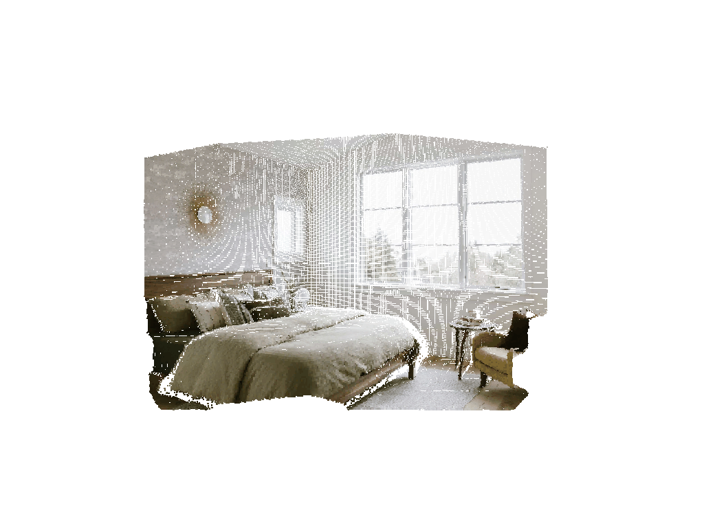

# pyocto-map-anything

Bring your images to life in 3D: Instantly transform a single photo into a vibrant voxel scene with the power of **AI depth estimation** and **OctoMap**.

This demo showcases **[pyoctomap](https://github.com/Spinkoo/pyoctomap)** - Python bindings for OctoMap that enable direct integration of AI depth predictions into C++ `ColorOcTree` structures, all from Python. The pipeline seamlessly combines state-of-the-art depth estimation models with OctoMap's efficient voxel-based 3D mapping.

## Example

Transform a single RGB image into a detailed 3D voxel reconstruction:

<div align="center">
  <table>
    <tr>
      <td align="center">
        <b>Input Image</b><br/>
        
      </td>
      <td align="center">
        <b>3D Voxel Reconstruction</b><br/>
        
      </td>
    </tr>
  </table>
</div>

> 📸 **See more examples:** Check out the [examples gallery](examples/README.md) for additional 3D reconstructions from various scenes.

## Purpose

This repository demonstrates how to:

- **Reconstruct 3D environments** from single RGB images using AI depth estimation
- **Integrate depth predictions** directly into OctoMap's voxel-based representation
- **Support multiple depth models** through a unified API (Depth Anything v3 and HuggingFace models)
- **Automatically estimate camera intrinsics** when using Depth Anything v3 models
- **Visualize and save** 3D reconstructions as OctoMap files

Built on **[pyoctomap](https://github.com/Spinkoo/pyoctomap)**, this demo highlights the power of Python-native OctoMap bindings for robotics, SLAM, and 3D reconstruction applications.

## Model Versatility & OctoMap Integration

The pipeline supports two families of depth estimation models with seamless integration:

### Depth Anything v3 (DA3) Models

Requires the [`depth_anything_3`](https://github.com/ByteDance-Seed/Depth-Anything-3) package (see [Installation](#depth-anything-v3-installation)).

| Model | Shortcut | Accuracy | Speed | Intrinsics | Use Case |
|-------|----------|----------|-------|------------|----------|
| `depth-anything/DA3NESTED-GIANT-LARGE-1.1` | `da3-giant-large` | Highest | Slowest | ✅ Automatic | **Recommended** — best overall (metric + multi-view) |
| `depth-anything/DA3NESTED-GIANT-LARGE` | — | Highest | Slowest | ✅ Automatic | Nested giant (deprecated; prefer `-1.1`) |
| `depth-anything/DA3-LARGE-1.1` | `da3-large` | High | Medium | ✅ Automatic | **Recommended** large model (retrained) |
| `depth-anything/DA3-LARGE` | — | High | Medium | ✅ Automatic | Large any-view model |
| `depth-anything/DA3-BASE` | `da3-base` | Good | Fast | ✅ Automatic | Faster inference |
| `depth-anything/DA3-SMALL` | `da3-small` | Moderate | Fastest | ✅ Automatic | Real-time / low memory |

> **Note:** Prefer models with the `-1.1` suffix — they were retrained after a bug fix and perform better, especially on street scenes. See the [official model table](https://github.com/ByteDance-Seed/Depth-Anything-3#-model-zoo).

**Key Features:**
- **Automatic camera intrinsics estimation** - No need to provide fx, fy, cx, cy
- **High accuracy** depth predictions in meters
- **State-of-the-art** performance on diverse scenes
- **CUDA strongly recommended** for acceptable inference speed

### HuggingFace Models

Works with `pip install -r requirements.txt` only (no DA3 package needed).

| Model | Shortcut | Accuracy | Speed | Intrinsics | Use Case |
|-------|----------|----------|-------|------------|----------|
| `Intel/zoedepth-nyu-kitti` | `zoe` | Excellent | Medium | ❌ FOV-based | High accuracy, general scenes |
| `Intel/dpt-large` | `dpt-large` | Very High | Slow | ❌ FOV-based | Maximum accuracy (HF models) |
| `Intel/dpt-hybrid-midas` | `dpt-hybrid` (default) | Good | Medium | ❌ FOV-based | Balanced performance |
| `depth-anything/Depth-Anything-V2-Small-hf` | `depth-anything` | Good | Fast | ❌ FOV-based | Fast general purpose (DA2 via transformers) |
| `Intel/dpt-beit-large-512` | `midas-small` | Moderate | Fastest | ❌ FOV-based | Quick processing |

Other ZoeDepth variants: `Intel/zoedepth-nyu`, `Intel/zoedepth-kitti`. DA2 Base/Large: `depth-anything/Depth-Anything-V2-Base-hf`, `depth-anything/Depth-Anything-V2-Large-hf`.

**Key Features:**
- **Easy installation** - Works with standard `transformers` library
- **No special setup** required
- **Wide model selection** from HuggingFace Hub
- **Depth Anything V2 (Transformers)** uses checkpoints such as [`depth-anything/Depth-Anything-V2-Small-hf`](https://huggingface.co/depth-anything/Depth-Anything-V2-Small-hf) (and Base/Large `-hf` variants); see the [model documentation](https://huggingface.co/docs/transformers/main/en/model_doc/depth_anything_v2)

### Unified Integration

All models work through the same API - simply change the `--model` argument. The pipeline automatically:
- Handles model-specific depth scaling
- Extracts camera intrinsics (DA3 models)
- Projects depth maps to 3D point clouds
- Fuses points into OctoMap's `ColorOcTree` structure

The **pyoctomap** library provides the bridge between Python and OctoMap's C++ implementation, enabling efficient voxel-based mapping directly from Python code.

## Installation

### Standard Dependencies

Install the core dependencies:

```bash
pip install -r requirements.txt
```

This installs:
- `pyoctomap` - Python bindings for OctoMap
- `transformers` - For HuggingFace depth models
- `torch` - PyTorch for model inference
- `opencv-python` - Image processing
- `open3d` - 3D visualization
- `numpy` - Numerical operations

### Depth Anything v3 Installation

To use Depth Anything v3 models, you need to install the `depth_anything_3` package separately:

#### Quick Install

```bash
# Install PyTorch dependencies
pip install xformers torch>=2 torchvision

# Clone the repository
git clone https://github.com/ByteDance-Seed/Depth-Anything-3.git
cd Depth-Anything-3

# Install the package
pip install -e .
```

**Note:** CUDA is recommended for faster inference. The models will work on CPU but will be significantly slower.

**Reference:** For detailed installation instructions and troubleshooting, see the [Depth Anything 3 repository](https://github.com/ByteDance-Seed/Depth-Anything-3).

## Usage

### Basic Example

Process a single image with the default model:

```bash
python demo_pyoctomap.py --input data/images/room2.jpg --visualize --resolution 0.005
```

### Using Depth Anything v3 Models

Depth Anything v3 models provide automatic camera intrinsics estimation:

```bash
# Recommended: DA3-LARGE-1.1 (shortcut: da3-large)
python demo_pyoctomap.py --input data/images/room1.jpg --visualize --model da3-large --resolution 0.005

# Best quality (slowest; shortcut: da3-giant-large)
python demo_pyoctomap.py --input data/images/room2.jpg --visualize --model da3-giant-large --resolution 0.005

# Faster inference
python demo_pyoctomap.py --input data/images/room3.jpg --visualize --model da3-base --resolution 0.005
```

When using DA3 models, you'll see output like:
```
Using DA3 estimated intrinsics: fx=381.6, fy=381.1, cx=252.0, cy=168.0
```

### Using HuggingFace Models

HuggingFace models use FOV-based intrinsics (default 65°):

```bash
# Using ZoeDepth (shortcut: zoe)
python demo_pyoctomap.py --input data/images/room2.jpg --visualize --model zoe --resolution 0.005

# Using default dpt-hybrid model
python demo_pyoctomap.py --input data/images/room3.jpg --visualize --resolution 0.005
```

### Saving OctoMap Files

Save the reconstruction to a file:

```bash
python demo_pyoctomap.py --input data/images/room3.jpg --model da3-large --output my_reconstruction.ot
```

### High-Resolution Mapping

For detailed reconstructions, use smaller resolution values:

```bash
python demo_pyoctomap.py --input data/images/white_house.jpg --visualize --model da3-large --resolution 0.005
```

## Command Reference

### Arguments

- `--input` (required): Path to input image file
- `--model`: Depth estimation model (default: `dpt-hybrid`)
  - **DA3 shortcuts** (require `depth_anything_3`): `da3-giant-large`, `da3-large`, `da3-base`, `da3-small`
  - **DA3 full names**: `depth-anything/DA3NESTED-GIANT-LARGE-1.1`, `depth-anything/DA3-LARGE-1.1`, `depth-anything/DA3-LARGE`, `depth-anything/DA3-BASE`, `depth-anything/DA3-SMALL`
  - **HF shortcuts**: `dpt-hybrid`, `dpt-large`, `zoe`, `depth-anything`, `midas-small`
  - **HF full names**: `Intel/zoedepth-nyu-kitti`, `Intel/dpt-large`, `Intel/dpt-hybrid-midas`, `depth-anything/Depth-Anything-V2-Small-hf`, `Intel/dpt-beit-large-512`
- `--resolution`: OctoMap voxel resolution in meters (default: `0.05`)
  - Smaller values = higher detail but more memory
  - Recommended: `0.005` for detailed scenes, `0.05` for general use
- `--fov`: Camera field of view in degrees (default: `65.0`)
  - Only used for HuggingFace models (DA3 models estimate intrinsics automatically)
- `--visualize`: Open interactive 3D viewer
- `--output`: Output file path for OctoMap (.ot format)

### Model Selection Guide

**Choose DA3 models when:**
- You need automatic camera intrinsics estimation
- You want highest accuracy depth predictions
- You have CUDA available for faster inference

**Choose HuggingFace models when:**
- You want quick setup without additional dependencies
- You prefer models from the HuggingFace ecosystem
- You're working on CPU or have limited GPU memory

### Resolution Recommendations

- **0.005m (5mm)**: High detail, suitable for indoor scenes, furniture, objects
- **0.01m (1cm)**: Good balance for most indoor/outdoor scenes
- **0.05m (5cm)**: General purpose, faster processing, less memory

## About pyoctomap

This demo is built on **[pyoctomap](https://github.com/Spinkoo/pyoctomap)**, a Python binding library for OctoMap that provides:

- Direct access to various categories of octrees from OctoMap in Python
- Efficient voxel-based 3D mapping
- Color integration for visual mapping (ColorOcTree)
- Binary file I/O for map persistence

Visit the [pyoctomap repository](https://github.com/Spinkoo/pyoctomap) to learn more about the library and explore additional features.

## License

This project is licensed under the MIT License - see the [LICENSE](LICENSE) file for details.

**Dependencies:**
- This project uses [Depth Anything 3](https://github.com/ByteDance-Seed/Depth-Anything-3) (Apache 2.0 License for codebase)
  - **Note:** Some model weights (e.g., DA3NESTED-GIANT-LARGE-1.1, DA3-GIANT, DA3-LARGE) are licensed under CC BY-NC 4.0 (non-commercial use only)
  - Models like DA3-BASE, DA3-SMALL, DA3METRIC-LARGE, and DA3MONO-LARGE are under Apache 2.0
- This project uses [pyoctomap](https://github.com/Spinkoo/pyoctomap) (check their repository for license details)

## Notes

- For issues or questions about Depth Anything 3, refer to the [official repository](https://github.com/ByteDance-Seed/Depth-Anything-3)
- For pyoctomap-related questions, visit the [pyoctomap repository](https://github.com/Spinkoo/pyoctomap)
