# Example Gallery

This folder contains example 3D reconstructions generated from single RGB images using AI depth estimation and OctoMap.

## Reconstructions with Animations

### Castle
<div align="center">
  <table>
    <tr>
      <td align="center">
        <b>Input Image</b><br/>
        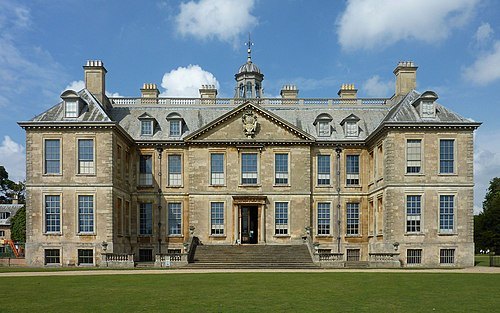
      </td>
      <td align="center">
        <b>3D Voxel Reconstruction</b><br/>
        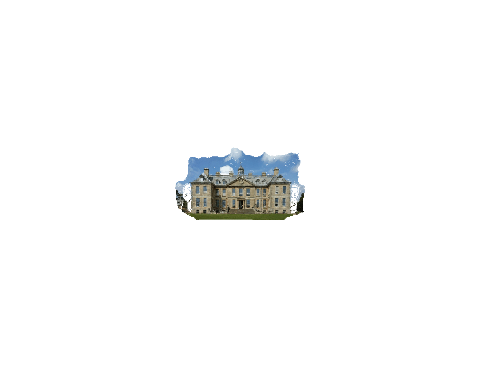
      </td>
    </tr>
  </table>
</div>

### Room 1
<div align="center">
  <table>
    <tr>
      <td align="center">
        <b>Input Image</b><br/>
        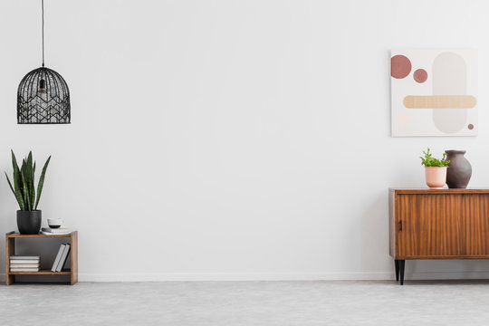
      </td>
      <td align="center">
        <b>3D Voxel Reconstruction</b><br/>
        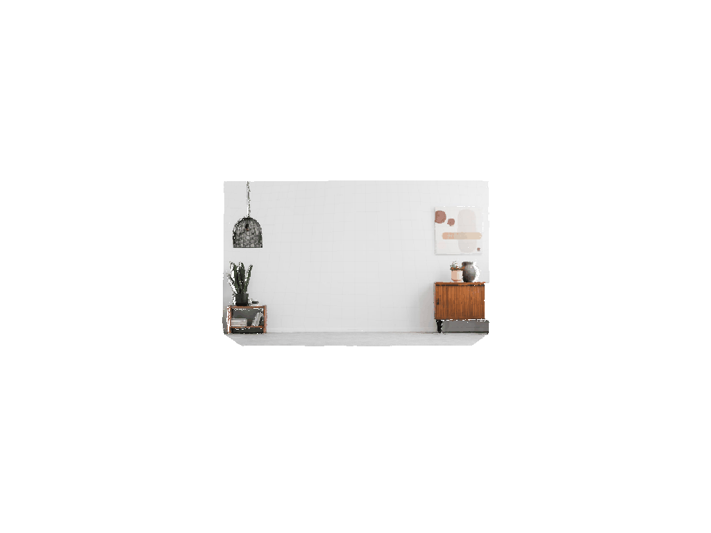
      </td>
    </tr>
  </table>
</div>

### Room 2
<div align="center">
  <table>
    <tr>
      <td align="center">
        <b>Input Image</b><br/>
        
      </td>
      <td align="center">
        <b>3D Voxel Reconstruction</b><br/>
        
      </td>
    </tr>
  </table>
</div>

### Room 3
<div align="center">
  <table>
    <tr>
      <td align="center">
        <b>Input Image</b><br/>
        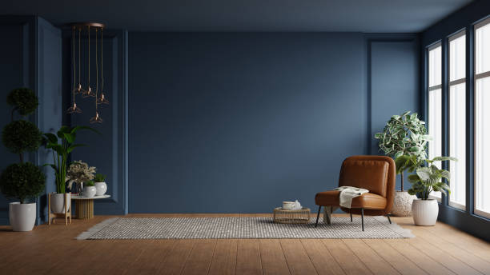
      </td>
      <td align="center">
        <b>3D Voxel Reconstruction</b><br/>
        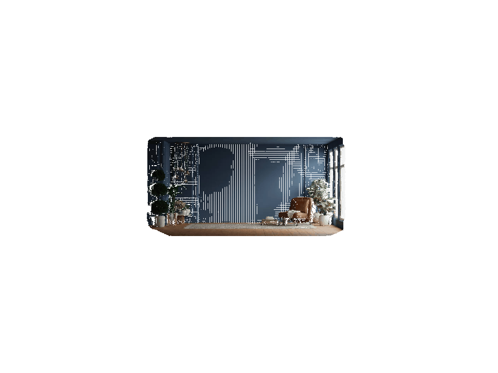
      </td>
    </tr>
  </table>
</div>

### White House
<div align="center">
  <table>
    <tr>
      <td align="center">
        <b>Input Image</b><br/>
        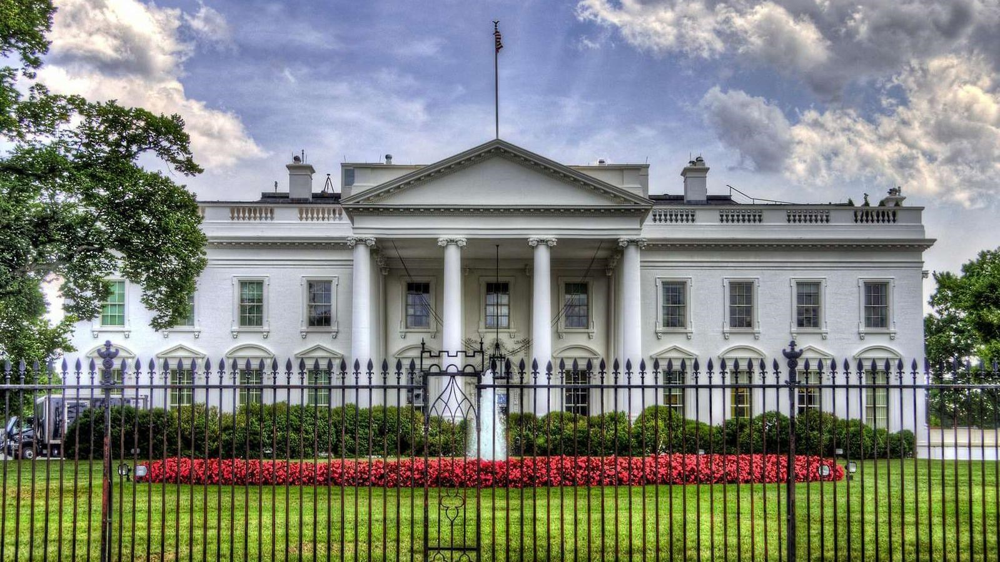
      </td>
      <td align="center">
        <b>3D Voxel Reconstruction</b><br/>
        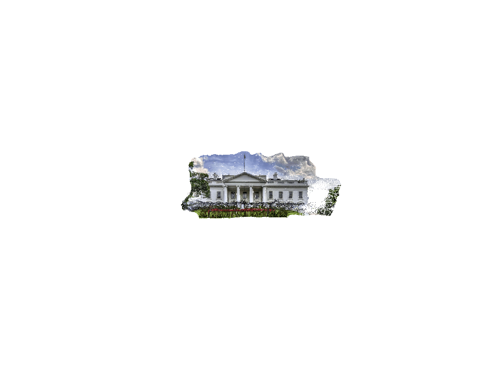
      </td>
    </tr>
  </table>
</div>

### Windows
<div align="center">
  <table>
    <tr>
      <td align="center">
        <b>Input Image</b><br/>
        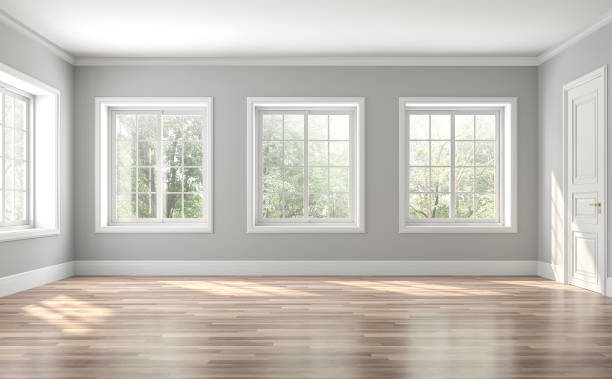
      </td>
      <td align="center">
        <b>3D Voxel Reconstruction</b><br/>
        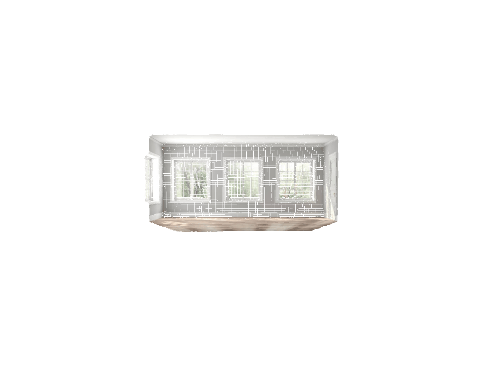
      </td>
    </tr>
  </table>
</div>

### Bedroom
<div align="center">
  <table>
    <tr>
      <td align="center">
        <b>Input Image</b><br/>
        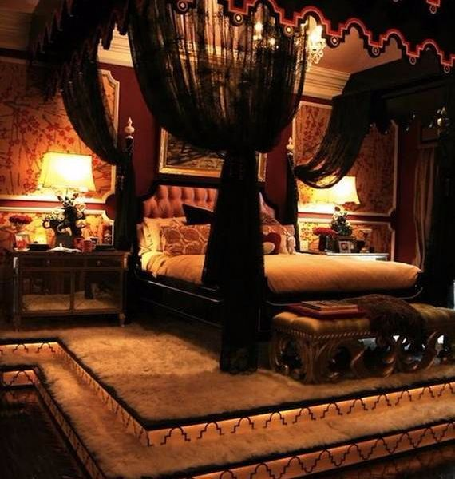
      </td>
      <td align="center">
        <b>3D Voxel Reconstruction</b><br/>
        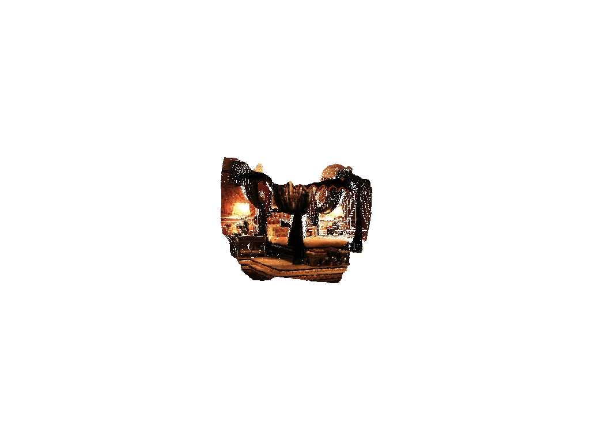
      </td>
    </tr>
  </table>
</div>

## Additional Sample Images

All sample images now have corresponding 3D reconstructions above.

To generate your own 3D reconstructions and GIFs, use:

```bash
python demo_pyoctomap.py --input data/images/<image_name>.jpg --visualize --gif examples/<output_name>.gif --resolution 0.005
```

Optional depth models are passed with `--model` (see the main [README](../README.md)); for example, Depth Anything V2 in Hugging Face `transformers` format uses IDs such as `depth-anything/Depth-Anything-V2-Small-hf`.

## How to Generate New Examples

1. Place your input image in `data/images/`
2. Run the reconstruction with GIF generation:
   ```bash
   python demo_pyoctomap.py --input data/images/your_image.jpg --gif examples/your_output.gif --resolution 0.005
   ```
3. The GIF will be saved in the `examples/` folder

For best results, use high-resolution images with good lighting and clear depth cues.
